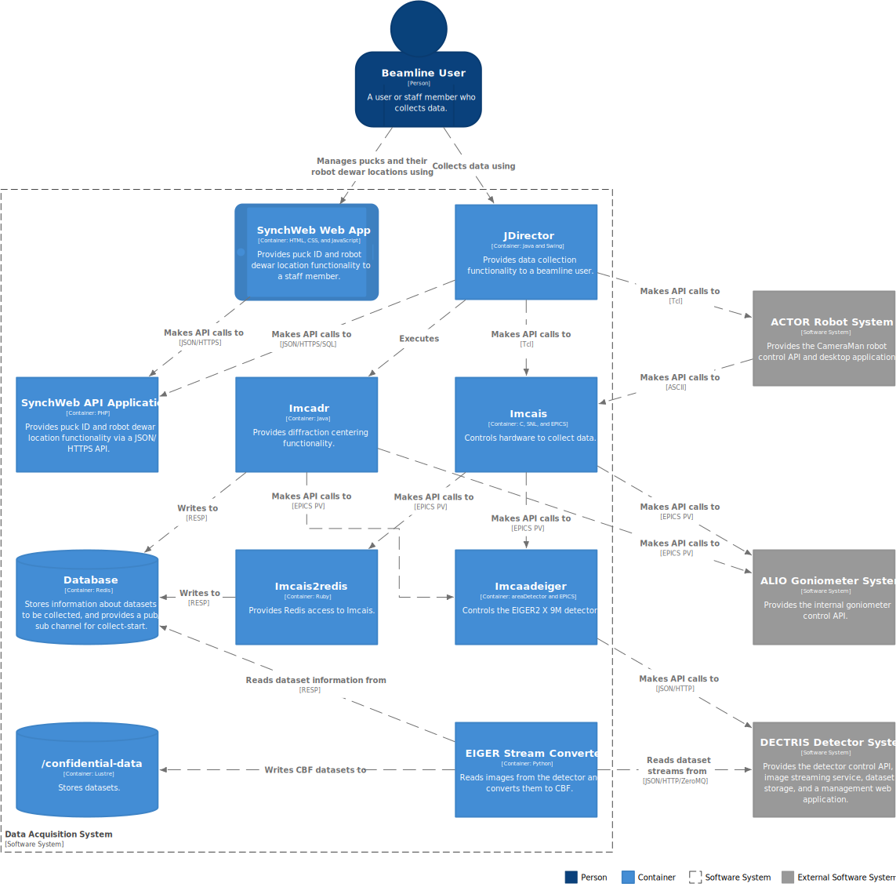

= IMCA-CAT Data Acquisition Staff Guide
// Antora
:navtitle: DAQ Staff Guide
// Metadata
:revdate: 0.1, 2024-04-29
// Settings
:nofooter:
:reproducible:
:sectnums:
:toc:
:toclevels: 1
// References
:alio: https://www.alioindustries.com/
:alio-support: https://www.alioindustries.com/contact-alio
:dectris: https://www.dectris.com/
:dectris-usa-support: https://www.dectris.com/company/dectris-usa/
:dcu-web-app: http://dcu/
:joe-digilio: https://imca-cat.org/tiki-index.php?page=Contact%20Us
:json: https://en.wikipedia.org/wiki/JSON
:lewis-muir: https://imca-cat.org/tiki-index.php?page=Contact%20Us
:mark-rivers: https://gsecars.uchicago.edu/staff-directory/

== Introduction

This guide covers data acquisition at IMCA-CAT for staff.

== Dealing with Problems

If a problem arises that is not a known problem with a standard recovery
procedure, staff should prefer to <<help,contact support>> rather than
restarting services or making other attempts at recovery.

== Architecture

.Container diagram for Data Acquisition System

== Executing Commands

The computer where an application runs is stated in this guide with the phrase
"`runs on `<name>``" where `<name>` is the hostname of the computer where
the application runs (e.g., "`runs on `loon``").  Any commands given for an
application are to be executed on the computer where the application runs,
so you will have to log into that computer in order to execute the given
commands.

You can log into some computers at the console _or_ remotely (e.g., `loon`).
Others, you can _only_ log in remotely (e.g., `seal`).  The way you log in
remotely is via a secure network protocol called SSH.  There are various SSH
clients, but a common command-line client is OpenSSH.  To log into a computer
with OpenSSH, execute `ssh <name>` where `<name>` is the hostname of the
computer you want to log into.  For example, to log into the computer named
`toad` from another computer on the IMCA-CAT network:

[subs="+quotes"]
----
$ *ssh toad*
----

To log out:

[subs="+quotes"]
----
$ *exit*
----

== SynchWeb API Application

The SynchWeb API application provides puck-ID and puck-location-in-robot-dewar
functionality for the data acquisition system.  The SynchWeb web app
communicates with the SynchWeb API application to manage which puck is in
which position in which robot dewar.  JDirector reads this information from
the SynchWeb API application to update its inventory.

The SynchWeb API application is designed to run indefinitely without being
restarted.

Symptoms that could indicate a problem with the SynchWeb API application that
might be solved by restarting it are as follows:

* JDirector reports an error related to automatically updating the inventory
  (e.g., "`Auto magazine info task encountered error while updating
  inventory`").

Runs on `ispyb`.

The SynchWeb API application is served by nginx (HTTP server) and PHP-FPM
(FastCGI server), which run as the `nginx` and `php-fpm` services,
respectively.

Staff do not have the privileges needed to view the logs of the `nginx` nor
`php-fpm` services, nor to start, stop, or restart them.

To display the status of the services:

[subs="+quotes"]
----
$ *systemctl status -l nginx*
$ *systemctl status -l php-fpm*
----

== Imcais2redis

Imcais2redis provides Imcais with access to Redis by adapting EPICS PVs to
Redis keys and a Redis pub/sub channel.  This enables Imcais to coordinate
with EIGER Stream Converter via Redis for acquiring EIGER2 X 9M datasets.

Imcais2redis is designed to run indefinitely without being restarted.

Symptoms that could indicate a problem with Imcais2redis that might be solved
by restarting it are as follows:

* Imcais reports an error about failing to set an "`EIGER SC`" value
  (e.g., `Failed to set EIGER SC number of images`).

* There's an error in the Imcais2redis log.  Of course, an error could
  indicate a problem with something outside of Imcais2redis in which case
  restarting it wouldn't help.  So, it depends on what the error is.

Runs on `loon`.

To view the current and last-rotated log, respectively:

[subs="+quotes"]
----
$ *sudo cat /var/opt/local/imcais/log/imcais2redis/main.log | less*
$ *sudo cat /var/opt/local/imcais/log/imcais2redis/main.log.0 | less*
----

To view the status of, start, stop, or restart the service, respectively:

[subs="+quotes"]
----
$ *systemctl status -l imcais2redis*
$ *sudo systemctl start imcais2redis*
$ *sudo systemctl stop imcais2redis*
$ *sudo systemctl restart imcais2redis*
----

== Imcaadeiger [[imcaadeiger]]

Imcaadeiger provides an areaDetector-based EPICS PV interface for controlling
the EIGER2 X 9M detector.  Imcaadeiger communicates with the DCU via the
SIMPLON API to control the EIGER2 X 9M.  Imcais and Imcadr use Imcaadeiger to
acquire datasets from the EIGER2 X 9M.

Imcaadeiger is designed to run indefinitely without being restarted.

Symptoms that could indicate a problem with Imcaadeiger that might be solved
by restarting it are as follows:

* Imcais reports an error about failing to set a value (e.g., `Failed to set
  photon energy`).

* There's an error in the Imcaadeiger log.  Of course, an error could indicate
  a problem with something outside of Imcaadeiger in which case restarting it
  wouldn't help.  So, it depends on what the error is:

** If the error is about the server returning error code 500
   (e.g., `RestApi::get: [param=temperature] server returned error code 500`),
   it means there's a problem with the DCU.  Try <<det-sys-int,initializing
   the detector>>.

Runs on `loon`.

To view the current log:

[subs="+quotes"]
----
$ *sudo cat /var/opt/local/epics-areadetector/log/imcaadeiger/current | less*
----

To view the status of, start, stop, or restart the service, respectively:

[subs="+quotes"]
----
$ *systemctl status -l imcaadeiger*
$ *sudo systemctl start imcaadeiger*
$ *sudo systemctl stop imcaadeiger*
$ *sudo systemctl restart imcaadeiger*
----

NOTE: Imcaadeiger communicates with the DCU via the SIMPLON API.  Since the
software that runs on the DCU is fragile and buggy, it is a good idea to check
the Imcaadeiger log after starting or restarting Imcaadeiger to ensure that
there are no errors.  If there are errors, it likely means something is wrong
with the DCU.  See <<det-sys>> for more information.

To change the beam center that gets written to each image header, do the
following on `loon`:

. Set the `17EIG1:cam1:BeamX` and `17EIG1:cam1:BeamY` PVs representing the X
  and Y beam center in detector pixels, respectively, via the `dbpf` function
  by editing the file `/etc/opt/local/imcaadeiger/config.cmd` (the number sign
  character `#` at the beginning of a line starts a comment that lasts to the
  end of the line).  For example, to set the X and Y beam center in pixels to
  1555.0 and 1674.5, respectively:
+
----
# X beam center in pixels; 2020-02-04
dbpf("17EIG1:cam1:BeamX", "1555.0")
# Y beam center in pixels; 2020-02-04
dbpf("17EIG1:cam1:BeamY", "1674.5")
----

. Restart the `imcaadeiger` service:
+
----
$ sudo systemctl restart imcaadeiger
----

== EIGER Stream Converter

EIGER Stream Converter reads acquired EIGER2 X 9M datasets from the DCU,
saves them as CBF datasets to a RAM disk, copies them from the RAM disk to
`/confidential-data`, and deletes them from the RAM disk when more space on
the RAM disk is needed for new datasets.

EIGER Stream Converter is designed to run indefinitely without being
restarted.

Symptoms that could indicate a problem with EIGER Stream Converter that might
be solved by restarting it are as follows:

* There's an error in the EIGER Stream Converter log.  Of course, an error
  could indicate a problem with something outside of EIGER Stream Converter in
  which case restarting it wouldn't help.  So, it depends on what the error
  is.

Runs on `epu` (EIGER2 Processing Unit).

IMPORTANT: SSH access to `epu` is restricted: only connections originating
from a beamline computer are allowed (e.g., `loon`).  This means you can only
log into `epu` via SSH from one of the beamline computers.  So, if you're not
logged into a beamline computer, you must first log into one, and then from
there you can log into `epu`.

To view the current and last-rotated logs, respectively:

[subs="+quotes"]
----
$ *sudo cat /var/opt/local/eiger-sc2/log/eiger_stream_main.log | less*
$ *sudo cat /var/opt/local/eiger-sc2/log/eiger_stream_main.log.1 | less*
$ *sudo cat /var/opt/local/eiger-sc2/log/file_tracker.log | less*
$ *sudo cat /var/opt/local/eiger-sc2/log/file_tracker.log.1 | less*
$ *sudo cat /var/opt/local/eiger-sc2/log/stream2cbf.log | less*
$ *sudo cat /var/opt/local/eiger-sc2/log/stream2cbf.log.1 | less*
----

To view the status of, start, stop, or restart the service, respectively:

[subs="+quotes"]
----
$ *systemctl status -l eiger-sc2*
$ *sudo systemctl start eiger-sc2*
$ *sudo systemctl stop eiger-sc2*
$ *sudo systemctl restart eiger-sc2*
----

== DECTRIS Detector System [[det-sys]]

WARNING: The DCU applications are fragile and buggy.  The EIGER2 web interface
has non-intuitive controls and doesn't always update itself when you would
expect.  It also doesn't always provide feedback about what it's doing, so it
could appear that the web interface has frozen, but in reality it could be
busy doing something that's taking a long time to complete.  The web interface
can also appear to be working, perhaps with cached data, when in fact the
underlying `detector` application providing the API is not working at all.

The system is composed of two hardware components: the EIGER2 X 9M detector
and the DCU (Detector Control Unit) which is a rack-mounted server.  There are
at least three applications that run on the DCU: the EIGER2 web interface, the
`calibration` application, and the `detector` application.

The EIGER2 web interface is the management web application that provides the
web UI that you use to manage the DCU with a web browser.  This web interface
is used for all DCU management procedures in this guide.

The `calibration` application is detector specific, and it's unclear exactly
what it does, but it must be running, and a guess is that it provides
calibration data for the detector (e.g., per-chip voltage and trim adjustments
for optimal energy calibration).

The `detector` application provides the SIMPLON API which is used to control
the detector and to save or stream acquired datasets.  It's unclear whether
the `detector` application provides anything else.

The DECTRIS detector system is designed to run indefinitely without DCU
applications being restarted and without the DCU being rebooted.

Symptoms that could indicate a problem with the DECTRIS detector system are as
follows:

* There's an error in the <<imcaadeiger,Imcaadeiger>> log about the server
  returning error code 500 (e.g., `RestApi::get: [param=temperature] server
  returned error code 500`).  To recover, try <<det-sys-int,initializing the
  detector>>.

* The detector initialization is unsuccessful.  To recover, try
  <<det-sys-restart-det-app,restarting>> the `detector` application.

* The `detector` application does not start successfully.  To recover, try
  <<det-sys-reboot-dcu,rebooting the DCU>>.

=== Connecting to the EIGER2 Web Interface [[det-sys-conn-dcu-web-app]]

To connect to the EIGER2 web interface, open {dcu-web-app} in a web browser
from a computer on the IMCA-CAT network.

=== Initializing the Detector [[det-sys-init]]

WARNING: This should only be performed when the detector is idle.

To initialize the detector, follow these steps:

. <<det-sys-conn-dcu-web-app,Open the EIGER2 web interface>>.

. Click ADMIN, and then under System Commands, click INITIALIZE.  Wait about
  one minute.  This should report success with a {json}[JSON] `"return_value"`
  value of `null`.  You must check the JSON status because the report may
  erroneously begin with the message `command executed successfully` even when
  it was actually _not_ successful.

. Restart <<imcaadeiger,Imcaadeiger>>.  This is required because during an
  initialize, many parameters managed by the SIMPLON API are reset to default
  values (e.g., `count_time`, `threshold_energy`, and Filewriter `mode`), so
  any changes previously made by Imcaadeiger via the SIMPLON API will be lost.

=== Checking the Status of the DCU

==== Checking Detector Connections [[det-sys-check-det-con]]

WARNING: This check should only be performed when the detector is idle.

To check the detector connections, follow these steps:

. <<det-sys-conn-dcu-web-app,Open the EIGER2 web interface>>.

. Click ADMIN, and then under System Commands, click CHECK DETECTOR
  CONNECTIONS.  Wait about one minute.  This should report success with
  a JSON `"return_value"` value containing `"status": "OK"`.  You must
  confirm the JSON status because the report may erroneously begin with the
  message `Command executed successfully` and yet contain, for example,
  `"status": "FAILED"`, in the JSON which would indicate it was actually _not_
  successful.

. <<det-sys-init,Initialize the detector>>.  This is required because the MCBs
  (Module Control Boards) are powered off over the course of the check and
  hence become uninitialized.

==== Checking System Information [[det-sys-check-sys-info]]

To check the system information, <<det-sys-conn-dcu-web-app,open the EIGER2
web interface>>, click ADMIN, and then under System Information, click the
round refresh button.  This should populate all of the boxes below it with
information in JSON.  If any of the information looks like an error message
(e.g., `could not update field det_temperature`), then it was not successful.

=== Restarting the detector Application [[det-sys-restart-det-app]]

WARNING: This should only be done when the detector is idle.

To restart the `detector` application, follow these steps:

. <<det-sys-conn-dcu-web-app,Open the EIGER2 web interface>>.

. Click ADMIN, then click APPLICATIONS.

. Stop the `detector` application in the Running box by following these steps:

.. Note the version of the `detector` application
   (e.g., `20.1.14.54474-g33c2095a0-stable`).  You can save it in a text file,
   take a screenshot, or whatever.  You will need to know this version when
   you start the application again.

.. Click the round stop button to the right of the `detector` application.

.. Click the round refresh button at the bottom-left of the box repeatedly
   until the `detector` application is no longer listed.

. Start the `detector` application from the Available Applications box by
  following these steps:

.. Select `detector` in the "`application`" drop-down menu.

.. Select `integration` in the "`branch`" drop-down menu.

.. Select the `detector` application version--the one you noted previously
   before stopping the `detector` application--in the "`version`" drop-down
   menu.

.. Click the round play button at the bottom of the box.

. In the Running box, click the round refresh button at the bottom-left of the
  box repeatedly until the `detector` application status is `healthy`.

. <<det-sys-check-det-con,Check the detector connections>>.

. <<det-sys-check-sys-info,Check the system information>>.

=== Rebooting the DCU [[det-sys-reboot-dcu]]

WARNING: This should only be done when the detector is idle.  Do not do this
unless you really need to.  This is very fragile and buggy.  Sometimes the
network interfaces do not come back up correctly in which case you may be
unable to reconnect to the EIGER2 web interface after the DCU boots which is
obviously very bad since it is used for all management of the DCU.  Sometimes,
the DCU does not boot correctly in which case you have to try rebooting again.

To reboot the DCU, follow these steps:

. <<det-sys-conn-dcu-web-app,Open the EIGER2 web interface>>.

. Click ADMIN, then under System Commands, click REBOOT DCU.  Wait about ten
  minutes.  Yes, you read that right: it takes about _ten minutes_ for the DCU
  to boot.

. Reload the EIGER2 web interface page in your web browser repeatedly until it
  successfully connects to the DCU and loads the EIGER2 web interface.

. Follow the steps in <<det-sys-restart-det-app>>.  If the `detector`
  application is already running and has a `healthy` status, skip the steps
  for stopping and starting the `detector` application; follow the rest of the
  steps.

== Help [[help]]

For support, contact these people, given in order of preference:

. {lewis-muir}[Lewis Muir]
+
All problem reports, comments, and questions welcome!  Comments and
corrections for this guide are also welcome.
+
NOTE: Call Lewis Muir's cell phone a second time if you get his voicemail the
first time.  This is because he sometimes uses the Do Not Disturb feature of
his iPhone with the Repeated Calls setting turned on.  With Do Not Disturb
turned on, all calls go directly to voicemail.  However, with Repeated Calls
turned on, if someone calls twice within three minutes, the second call will
ring through and not go directly to voicemail.

. {joe-digilio}[Joe Digilio]
+
Contact if Lewis Muir cannot be reached.

. {mark-rivers}[Mark Rivers]
+
Contact if Joe Digilio cannot be reached.
+
NOTE: Mark Rivers has no obligation to provide support to IMCA-CAT, so
contacting him should only be a last resort.

If you cannot reach any of the above people, then you can try these contacts:

* {alio}[ALIO]
+
For issues related to ALIO hardware, contact {alio-support}[ALIO Support].
If you can't get in touch with someone quickly and would like to try
communicating directly with someone, try the VP of Engineering:
+
Nathan Brown +
Email: nathan@alioindustries.com

* {dectris}[DECTRIS]
+
For issues related to DECTRIS hardware, contact {dectris-usa-support}[DECTRIS
USA Support].  If you can't get in touch with someone quickly and would like
to try communicating directly with someone, try either of the following:
+
Zachary Brown +
Email: zachary.brown@dectris.com
+
Pascal Hofer +
Email: pascal.hofer@dectris.com
